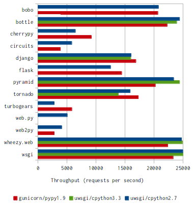
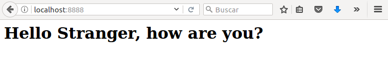
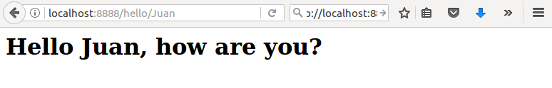
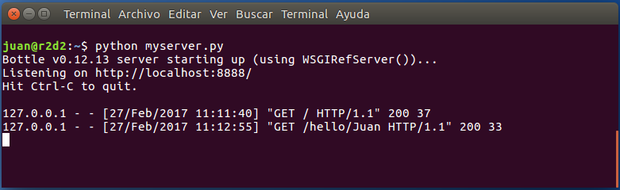

# Servidor API REST Bottle


## Índice
1. Introducción, API REST
2. Bottle
3. Instalación
4. Aplicación de ejemplo con Python y Bottle
5. Referencias

## 1. Introducción, API REST

Las **API REST** se han convertido en una forma común de establecer una interfaz entre los back-ends y los front-ends de la web, y entre diferentes servicios web. La simplicidad de este tipo de interfaz, y el soporte omnipresente de los protocolos HTTP y HTTPS a través de diferentes redes y marcos, lo convierten en una opción fácil al considerar los problemas de interoperabilidad.

## 2. Bottle

**Bottle** es un **framework web minimalista de Python, ligero, rápido, fácil de usar y muy adecuado para la construcción de servicios RESTful**.

Esta pequeña librería se distribuye como un archivo único, **sin más dependencias que las que tiene Python** por defecto.

Es muy **útil para probar pequeñas páginas web en python** sin necesidad de abordar grandes configuraciones.

Bottle cumple con la interfaz de servidor web estándar de Python WSGI (Web Server Gateway Interface) , lo que significa que **puede utilizarse con cualquier servidor compatible con WSGI**. Esto incluye uWSGI, Tornado, Gunicorn, Apache, Amazon Beanstalk, Google App Engine y otros.

Bottle es **agnóstico de base de datos**, no importa de dónde vienen los datos. Si se necesita utilizar una base de datos en una aplicación, la lista de paquetes de Python cuenta con varias opciones interesantes como SQLAlchemy, PyMongo, MongoEngine, CouchDB, Boto para DynamoDB, etc. Sólo se necesita el adaptador adecuado para que funcione con la base de datos elegida.

Una [comparativa](http://mindref.blogspot.com.es/2012/09/python-fastest-web-framework.html) realizada por Andriy Kornatskyy situó a Bottle como **uno de los tres marcos superiores en términos de tiempo de respuesta y rendimiento** (peticiones por segundo).



Otras [pruebas](https://www.toptal.com/bottle/building-a-rest-api-with-bottle-framework) realizadas por Leandro Lima en servidores virtuales de DigitalOcean, con servidores web uWSGI y Bottle arrojaron como resultado **respuestas de tan solo 140μs por solicitud**.

Bottle cuenta con los siguientes servicios:
- **Enrutamiento**: mapeo de llamada a funciones con soporte para urls limpias y dinámicas.
- **Plantillas**: motor de plantillas rápido con soporte para templates mako, jinja2 y cheetah.
- **Servicios**: acceso para formar datos, cargar archivos, utilizar cookies, headers y otros metadatos relacionados con HTTP.
- **Servidor**: incorpora un servidor de desarollo y soporte para cualquier servidor HTTP compatible con WSGI (Google App Engine, cherrypy, fapws3, bjoern, paste...).

También existen otros frameworks con numerosas librerías y herramientas integradas en su arquitectura, por ejemplo Django, que permiten levantar servicios muy potentes y construir grandes aplicaciones en poco tiempo.

## 3. Instalación

Para obtener la última versión del framework **Bottle** se puede utilizar la utilidad _pip_ que permite la instalación de aplicaciones python. 

Se puede descargar e instalar Bottle en un sistema operativo Ubuntu 16.04 Xenial por línea de comandos abriendo un terminal y ejecutando las siguientes instrucciones:

```
# Instalar pip (en caso de que no esté ya instalado)
apt-get install python-pip

# Instalar Bottle
pip install bottle
```

## 4. Aplicación de ejemplo con Python y Bottle

Como ejemplo de uso se creará una sencilla aplicación que muestre un mensaje de bienvenida en una página web.

La aplicación enrutará dos url's, una estática y otra dinámica en la que se deberá pasar un nombre.

En primer lugar hay que crear el fichero python con la lógica del servidor y el enrutamiento. Por ejemplo _myserver.py_:

```
from bottle import route, run


@route('/')
app = application = bottle.default_app()@route('/hello/<name>')
def greet(name='Stranger'):
    return '<h1>Hello %s, how are you?</h1>' % name

if __name__ == '__main__':
    run(host='localhost', port=8888, debug=True)
```

Con _@route(...)_ se especifican las dos url's, la primera es la estática (/) y la segunda la dinámica (/hello/<name>).

La función pyhton _greet_ se encarga de construir el mensaje según que la url contenga o no un valor para el parámetro nombre.

La última línea del fichero especifica el host (localhost) y el puerto (8888) donde se servirán las peticiones.

Después se ejecuta por línea de comandos la siguiente instrucción para tener disponible el servidor:
```
python myserver.py
```

Por último, se abre un navegador web y se accede a las siguientes url (la primera s la estática, la segunda la dinámica):
```
http://localhost:8888
http://localhost:8888/hello/Juan
```

Las imágenes siguientes muestran las ventanas del navegador para las dos peticiones y el log de salida del servidor:







La lista de referencias contiene enlaces con información más extensa para implementar serviciosRESTfull más complejos.

## 5. Referencias

- Bottle: Python Web Framework
    - https://bottlepy.org/docs/dev/

- Crear páginas web con Bottle: Python Web Framework
    - http://www.josedomingo.org/pledin/2015/03/crear-paginas-web-con-bottle-python-web-framework_1a_parte/
    - http://www.josedomingo.org/pledin/2015/03/crear-paginas-web-con-bottle-trabajando-con-plantillas-2a-parte/

- Building a Rest API with the Bottle Framework
    - https://www.toptal.com/bottle/building-a-rest-api-with-bottle-framework

- Python Fastest Web Framework 
    - http://mindref.blogspot.com.es/2012/09/python-fastest-web-framework.html

